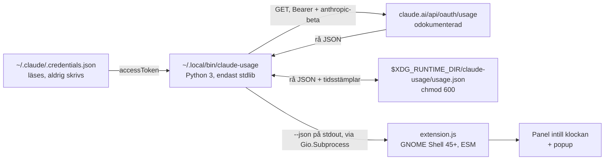

# Claude Usage för GNOME Shell

Visar din Claude-prenumerations användningsgränser i GNOME:s toppanel — samma
siffror som Usage-vyn i Claude-appen: sessionsgränsen (5 h), veckogränsen för
alla modeller, eventuella modellspecifika veckogränser, och credits.

Indikatorn sitter i panelens mittbox, **direkt till höger om klockan**. Den visar
den högsta aktuella procenten och en färgprick (blå under 70 %, gul från 70 %,
röd från 90 %). Popupen ger en rad per gräns med etikett, procent, en stapel och
nedräkning till nästa återställning. Credits ligger sist.

```
┌─────────────────────────────────────┐
│ Uppdaterad 12 s sedan               │
│ ─────────────────────────────────── │
│ Session (5 h)                 42 %  │
│ ████████░░░░░░░░░░░░                │
│ återställs om 2 h 13 min            │
│                                     │
│ Vecka – alla modeller         67 %  │
│ █████████████░░░░░░░                │
│ återställs om 3 d 11 h              │
│                                     │
│ Vecka – Opus                93.5 %  │
│ ███████████████████░                │
│ återställs om 3 d 11 h              │
│                                     │
│ Credits                             │
│ Used credits: 1.5 · Credit limit: 25│
│ ─────────────────────────────────── │
│ ⟳  Uppdatera nu                     │
└─────────────────────────────────────┘
```

> [!WARNING]
> **Datakällan är odokumenterad.** Siffrorna hämtas från
> `GET https://claude.ai/api/oauth/usage`, den endpoint som
> `claude.ai/settings/usage` och Claude Code använder internt. Den är inte en
> publik, stödd eller versionerad del av något API. Den kan ändra form, byta
> fältnamn eller **sluta fungera helt utan förvarning**, och det finns ingen
> garanti för att den fortsätter finnas. Tillägget är byggt för att degradera
> snyggt när det händer — okända nycklar renderas ändå, och fel visas i popupen
> i stället för att tömma panelen — men räkna med att det en dag bara slutar
> visa siffror.

## Innehåll

- [Så fungerar det](#så-fungerar-det)
- [Krav](#krav)
- [Installation](#installation)
- [Discovery: kolla den råa JSON:en först](#discovery-kolla-den-råa-jsonen-först)
- [Generisk parsning och etiketter](#generisk-parsning-och-etiketter)
- [Kommandoradsanvändning](#kommandoradsanvändning)
- [JSON-kontraktet mellan delarna](#json-kontraktet-mellan-delarna)
- [Tider, cache och rate limiting](#tider-cache-och-rate-limiting)
- [Säkerhet: token och cache](#säkerhet-token-och-cache)
- [Beteende vid fel](#beteende-vid-fel)
- [Grafiken](#grafiken)
- [GNOME-versioner](#gnome-versioner)
- [Felsökning](#felsökning)
- [Kända begränsningar](#kända-begränsningar)
- [Utveckling och tester](#utveckling-och-tester)

## Så fungerar det

Två delar, för att ingen tokenhantering ska hamna i GJS. Tillägget ser aldrig
någon token — bara normaliserad JSON på stdout.



Ansvarsfördelningen:

| Del | Ansvar |
| --- | --- |
| `bin/claude-usage` | Läsa token, hämta, tolka svaret generiskt, cacha, rate limita, formatera etiketter, producera stabil JSON |
| `extension/extension.js` | Köra skriptet, rita panel och popup, hålla timers, städa i `disable()` |

All tolkning och alla etiketter ligger i Python-delen. Tillägget renderar den
`label` skriptet skickar och gör inga egna antaganden om nycklarna — vilket
betyder att en ändrad endpoint bara kräver ändringar på ett ställe.

### Filerna i repot

```
bin/claude-usage            CLI:t. Hämtning, cache, normalisering, etiketter.
extension/
  extension.js              Indikatorn. ESM för GNOME 45+.
  metadata.json             UUID, namn, shell-version.
  stylesheet.css            Adwaita-anpassad stil.
install.sh                  Versionskoll, kopiering, aktivering, rökprovning.
tests/
  run.sh                    Kör allt.
  test_claude_usage.py      44 tester mot CLI:t via en lokal stubbserver.
  js/
    test_extension.mjs      36 tester mot extension.js.
    stubs.mjs               Stubbar för St, GLib, Gio, Clutter, PopupMenu m.fl.
    loader.mjs              ESM-loader som mappar gi:// och resource:// till stubbarna.
    register.mjs            Registrerar loadern.
```

## Krav

- Fedora Workstation med **GNOME Shell 45 eller senare** (tillägget använder
  ESM, som infördes i 45)
- `python3` (finns i Fedora Workstation)
- Claude Code inloggat, så att `~/.claude/.credentials.json` finns

Inga andra beroenden — inga pip-paket, inga npm-paket, inget utanför
Python-stdlib och GNOME:s egna bibliotek. `node` behövs bara för att köra
JS-testerna.

## Installation

```bash
git clone https://github.com/hhammarstrand/fedora-workstation-claude-usage.git
cd fedora-workstation-claude-usage
./install.sh
```

`install.sh` gör sex saker, i ordning:

1. Kontrollerar `gnome-shell --version` och avbryter om major < 45.
2. Kopierar skriptet till `~/.local/bin/claude-usage` (läge 755).
3. Kopierar tillägget till
   `~/.local/share/gnome-shell/extensions/claude-usage@hhammarstrand.github.io/`.
4. **Lägger in din major-version i den installerade `metadata.json`** om den inte
   redan står där. Detta är viktigt: en Shell-version som inte listas i
   `shell-version` gör att tillägget tyst inte laddas alls, utan felmeddelande.
5. Aktiverar tillägget med `gnome-extensions enable`, med `gsettings` som
   reserv (Shell känner inte till tillägget förrän det startat om).
6. Provkör `claude-usage --text` och visar resultatet.

**Logga sedan ut och in igen.** Wayland kan inte ladda om GNOME Shell live, så
`Alt+F2` → `r` finns inte som genväg där. Utloggning är det som gäller.

<details>
<summary>Manuellt, om du inte vill köra skriptet</summary>

```bash
UUID=claude-usage@hhammarstrand.github.io

gnome-shell --version                     # kolla att major >= 45

install -Dm755 bin/claude-usage ~/.local/bin/claude-usage
mkdir -p ~/.local/share/gnome-shell/extensions/$UUID
cp extension/{extension.js,stylesheet.css,metadata.json} \
   ~/.local/share/gnome-shell/extensions/$UUID/

# Lägg till din version i shell-version om den saknas:
$EDITOR ~/.local/share/gnome-shell/extensions/$UUID/metadata.json

gnome-extensions enable $UUID
# logga ut och in igen
```
</details>

### Uppdatera

```bash
git pull
./install.sh
```

Skriptet är idempotent. Logga ut och in igen för att ladda den nya
`extension.js` — Wayland kan inte byta ut den i en körande session.

### Avinstallera

```bash
gnome-extensions disable claude-usage@hhammarstrand.github.io
rm -rf ~/.local/share/gnome-shell/extensions/claude-usage@hhammarstrand.github.io
rm -f ~/.local/bin/claude-usage
rm -rf "$XDG_RUNTIME_DIR/claude-usage"
```

Logga ut och in igen. `~/.claude/.credentials.json` rörs inte.

## Discovery: kolla den råa JSON:en först

Formen på svaret varierar mellan planer och över tid, så det är värt att se vad
*ditt* konto faktiskt får tillbaka:

```bash
claude-usage --raw
```

Rå JSON går till stdout, all metadata till stderr — så `claude-usage --raw | jq`
fungerar. Jämför nycklarna med `KNOWN_LABELS` i `bin/claude-usage`.

Publikt rapporterad form är ett toppobjekt där varje gräns är en nyckel med
`{utilization, resets_at}`, plus `extra_usage` för credits:

```json
{
  "five_hour":      { "utilization": 42,   "resets_at": "2026-08-11T22:00:00Z" },
  "seven_day":      { "utilization": 67,   "resets_at": "2026-08-15T09:30:00Z" },
  "seven_day_opus": { "utilization": 93.5, "resets_at": "2026-08-15T09:30:00Z" },
  "extra_usage":    { "used_credits": 1.5, "credit_limit": 25, "enabled": true }
}
```

Men **ingenting av det är hårdkodat** — se nästa avsnitt.

## Generisk parsning och etiketter

### Vad som blir vad

Parsern itererar över alla toppnycklar och klassar varje värde:

| Villkor | Resultat |
| --- | --- |
| Objekt med ett `utilization`-fält | **Gräns** — egen rad med stapel |
| Nyckeln är `extra_usage` eller innehåller `credit` | **Credits** — renderas sist |
| Objekt utan `utilization` | **Ej tolkad** — listas i popupen, tappas inte |
| Skalärt värde eller lista | **Ej tolkad** — listas i popupen |

Som `utilization` accepteras, i den ordningen: `utilization`, `utilisation`,
`utilization_percent`, `percent_used`, `percent`. Värdet får vara heltal,
decimaltal eller sträng (`"42"`, `"42%"`, `"42,5"`).

Hittas inga gränser på toppnivån letar parsern **ett** steg djupare, så att ett
svar som `{"usage": {"five_hour": …}}` också fungerar.

### Ordning

Rader sorteras efter fönsterlängd, kortast först, med generella gränser före
modellspecifika:

1. `five_hour` (5 h)
2. `seven_day` (7 d, generell)
3. `seven_day_cowork`, `seven_day_opus`, … (7 d, modellspecifika, alfabetiskt)
4. Nycklar utan tolkningsbart tidsfönster, alfabetiskt
5. Credits, alltid sist

### Etiketter

Nycklar som inte står i `KNOWN_LABELS` **tappas inte bort** — de får ett
autogenererat namn och märks med `*` i popupen:

| Nyckel | Etikett |
| --- | --- |
| `five_hour` | Session (5 h) |
| `seven_day` | Vecka – alla modeller |
| `seven_day_opus` | Vecka – Opus |
| `seven_day_sonnet` | Vecka – Sonnet |
| `seven_day_haiku` | Vecka – Haiku |
| `seven_day_cowork` | Vecka – Cowork |
| `seven_day_oauth_apps` | Vecka – OAuth-appar |
| `extra_usage` | Credits *(renderas sist)* |
| `thirty_day_fable` | `30 dagar – Fable` *(autogenererad)* |
| `helt_okänd_nyckel` | `Helt okänd nyckel` *(autogenererad)* |

Autogenereringen förstår talord (`one`…`ninety`) och enheter (`second`,
`minute`, `hour`, `day`, `week`, `month`) samt modellnamn som suffix. Går nyckeln
inte att tolka alls blir den `Understreck_ersätts_med_mellanslag` med versal
begynnelsebokstav — aldrig tom.

Vill du byta en etikett räcker det att redigera `KNOWN_LABELS` i
`bin/claude-usage`. Etiketterna finns bara på ett ställe.

### Tidsstämplar

`resets_at` tolkas i följande format, i den ordningen:

- ISO 8601 med `Z` eller offset (`2026-08-15T09:30:00Z`, `…+02:00`)
- ISO 8601 utan zon — tolkas då som UTC
- Nanosekundsprecision trimmas till mikrosekunder
- Epoch i sekunder (`1786485600`) eller millisekunder (`1786485600000`) —
  avgörs på storleken
- Samma värden som sträng

Fältnamnet behöver inte vara `resets_at`: `reset_at`, `resets`, `reset`,
`next_reset_at` och alla nycklar som innehåller `reset` prövas också. Går tiden
inte att tolka står det *"ingen känd återställningstid"* i stället för en
felaktig nedräkning.

## Kommandoradsanvändning

```bash
claude-usage              # läsbar text (samma som --text)
claude-usage --text       # läsbar text
claude-usage --json       # normaliserad JSON, det tillägget läser
claude-usage --raw        # serverns svar ordagrant
claude-usage --force      # gå förbi cachen (kombineras med ovanstående)
claude-usage --help
```

Utdatalägena är ömsesidigt uteslutande.

```
$ claude-usage --text
Claude usage · uppdaterad 12 s sedan
  Session (5 h)            42 %  ████████░░░░░░░░░░░░  återställs om 2 h 13 min
  Vecka – alla modeller    67 %  █████████████░░░░░░░  återställs om 3 d 11 h
  Vecka – Cowork            0 %  ░░░░░░░░░░░░░░░░░░░░  återställs om 3 d 11 h
  Vecka – Opus           93.5 %  ███████████████████░  återställs om 3 d 11 h
  Credits                Used credits: 1.5 · Credit limit: 25 · Enabled: ja
  Endpointen är odokumenterad och kan ändras utan förvarning.
```

### Exitkoder

| Kod | Betyder |
| --- | --- |
| `0` | Det finns siffror att visa (färska eller cachade) |
| `1` | Ingen data alls, eller internt fel |
| `2` | Felaktiga argument (från `argparse`) |

`--json` skriver **alltid** giltig JSON, även vid fel, så tillägget alltid har
något att tolka. Vid fel går textutdata till stderr i stället för stdout.

### Miljövariabler

Alla är valfria. De tre första finns främst för test och felsökning.

| Variabel | Standard | Effekt |
| --- | --- | --- |
| `CLAUDE_USAGE_ENDPOINT` | `https://claude.ai/api/oauth/usage` | Annan URL att hämta från |
| `CLAUDE_USAGE_CREDENTIALS` | `~/.claude/.credentials.json` | Annan credentials-fil |
| `CLAUDE_USAGE_USER_AGENT` | `claude-usage/1.0` | Annan User-Agent, om ett CDN svarar 403 |
| `XDG_RUNTIME_DIR` | satt av systemd | Var cachen läggs |

## JSON-kontraktet mellan delarna

Det här är vad `--json` skriver, och därmed gränssnittet mellan Python-delen och
tillägget. `schema` räknas upp om formen bryts.

### Toppnivå

| Fält | Typ | Betydelse |
| --- | --- | --- |
| `schema` | int | Versionen på det här formatet, just nu `1` |
| `ok` | bool | Om det finns siffror att visa, färska eller cachade |
| `stale` | bool | Sant vid fel, eller om datan är äldre än 300 s |
| `source` | `"network"` \| `"cache"` | Om ett riktigt anrop gjordes och lyckades |
| `now` | float | Epoch när utdatan skapades |
| `fetched_at` | float \| null | Epoch när datan senast hämtades |
| `age_seconds` | int \| null | Datans ålder |
| `error` | objekt \| null | Se nedan |
| `limits` | lista | En post per gräns, sorterad |
| `credits` | objekt \| null | Credits-raden |
| `unrecognized` | lista | `{key, reason}` för nycklar som inte tolkades |
| `max_percent` | float \| null | Högsta procenten bland gränserna |
| `max_severity` | sträng | `ok`, `warn`, `crit` eller `unknown` |
| `endpoint_documented` | bool | Alltid `false`. En påminnelse. |

### En post i `limits`

| Fält | Typ | Betydelse |
| --- | --- | --- |
| `key` | sträng | Nyckeln från servern, ordagrant |
| `label` | sträng | Etikett att visa. Aldrig tom. |
| `known` | bool | `false` = autogenererad etikett, visas med `*` |
| `percent` | float \| null | Utnyttjandet |
| `severity` | sträng | `ok` (< 70), `warn` (70–89), `crit` (≥ 90), `unknown` |
| `utilization_field` | sträng | Vilket fältnamn procenten kom ifrån |
| `window_seconds` | int \| null | Tolkad fönsterlängd, för sortering |
| `scope` | sträng \| null | Modellsuffix, t.ex. `opus` |
| `resets_at` | valfri | Serverns värde, ordagrant |
| `resets_at_epoch` | float \| null | Tolkad epoch |
| `resets_in_seconds` | float \| null | Sekunder kvar när utdatan skapades |

Tillägget räknar nedräkningen från `resets_at_epoch` lokalt, inte från
`resets_in_seconds` — så den tickar korrekt även på cachad data.

### `credits`

Samma fält som en gräns, plus `fields`: en lista av `{key, label, value}` för
varje skalärt fält i objektet. Formen på `extra_usage` är okänd, så allt
renderas generiskt som `Etikett: värde`.

### `error.kind`

Stabila strängar, avsedda att jämföras mot i kod:

| `kind` | Orsak |
| --- | --- |
| `no_credentials` | Credentials-filen saknas eller får inte läsas |
| `bad_credentials` | Filen finns men är inte giltig JSON |
| `no_token` | Ingen `claudeAiOauth.accessToken` i filen |
| `unauthorized` | HTTP 401 — token avvisad |
| `forbidden` | HTTP 403 med JSON-svar |
| `blocked` | HTTP 403 med HTML-svar — bot-skydd före API:et |
| `rate_limited` | HTTP 429. `retry_after` sätts om servern skickade det. |
| `server_error` | HTTP 5xx |
| `http_error` | Annan oväntad status |
| `network_error` | Uppkoppling, DNS eller tidsgräns |
| `bad_response` | Svaret var inte JSON, eller inte ett objekt |
| `internal_error` | Bugg i skriptet |

## Tider, cache och rate limiting

| Vad | Värde | Var |
| --- | --- | --- |
| Cache-TTL vid automatisk pollning | 60 s | `CACHE_TTL` |
| Golv även med `--force` | 15 s | `FORCE_MIN_INTERVAL` |
| Väntetid efter ett misslyckat anrop | 30 s | `ERROR_BACKOFF` |
| Ålder då datan markeras cachad | 300 s | `STALE_AFTER` |
| Tidsgräns för HTTP-anropet | 10 s | `HTTP_TIMEOUT` |
| Tillägget hämtar nytt | var 60 s | `REFRESH_INTERVAL` |
| Tillägget räknar om nedräkningar | var 15 s | `CLOCK_INTERVAL` |
| Nödbroms om skriptet hänger | 20 s | `SUBPROCESS_TIMEOUT` |

Tillägget hämtar också när popupen öppnas, men respekterar cachen — så att öppna
och stänga menyn upprepade gånger inte genererar trafik. **"Uppdatera nu"** går
förbi TTL:en, men golvet på 15 s står kvar så att knappen inte kan hamra
endpointen.

Nettoresultatet: som mest ett nätverksanrop per minut vid normal drift, och som
mest ett per 15 s om du sitter och klickar.

## Säkerhet: token och cache

- Token läses från `~/.claude/.credentials.json`
  (`claudeAiOauth.accessToken`). **Filen läses bara, aldrig skrivs** — Claude
  Code sköter förnyelsen själv.
- Bara `accessToken` läses. `refreshToken` rörs inte.
- **Token skrivs aldrig ut** — inte i loggar, inte i felmeddelanden. Alla
  felsträngar går genom en scrubber som maskar både den kända token och allt som
  ser ut som en hemlighet (`Bearer …`, `sk-…`).
- **Svarskroppar loggas aldrig.** Vid fel rapporteras bara HTTP-status och
  innehållstyp, så att varken token eller kontodata kan läcka via ett
  felmeddelande.
- Cachen ligger i `$XDG_RUNTIME_DIR/claude-usage/usage.json` med `chmod 600`
  (katalogen `700`), skriven atomiskt via `os.replace`. Saknas
  `XDG_RUNTIME_DIR` används en uid-specifik katalog under `TMPDIR`.
- **Cachen innehåller ingen token** — bara serverns svar och tidsstämplar.
- Tillägget ser aldrig någon token. Det får bara normaliserad JSON på stdout.

Testerna kontrollerar det sista uttryckligen: token får inte förekomma i stdout
eller stderr i något utdataläge, i något felläge, eller i cache-filen — inte ens
när servern skickar tillbaka token i sitt eget svar.

## Beteende vid fel

Inget av dessa lägen tömmer panelen eller kraschar tillägget.

| Situation | Vad som händer |
| --- | --- |
| 429 med cache | Cachade siffror visas, dimmade. Popupen säger 429 och `Retry-After`. |
| 429 utan cache | Panelen visar `!`, popupen förklarar. |
| Nätverksfel eller 5xx | Som 429: cachad data om den finns. |
| HTML-svar (CDN-skydd) | `bad_response` eller `blocked`. Svarskroppen loggas inte. |
| Token utgången | Anropet görs ändå — servern är sanningen. 401 ger `unauthorized`. |
| Credentials saknas | `no_credentials` med hänvisning till Claude Code. |
| Trasig credentials-fil | `bad_credentials`. Inget nätverksanrop görs. |
| Skriptet saknas | Popupen visar sökvägen som inte gick att köra. "Uppdatera nu" finns kvar. |
| Skriptet ger ogiltig JSON | Felet visas; senaste kända siffror behålls. |
| Skriptet hänger | Avbryts efter 20 s. Panelen låser sig inte. |
| Trasig cache-fil | Ignoreras, hämtas om. |
| Svar utan gränser | *"Svaret innehöll inga gränser."* |
| Okänd nyckel | Renderas med autogenererad etikett och `*`. |
| Nyckel utan `utilization` | Listas som ej tolkad. Tappas inte. |
| Procent över 100 | Stapeln kapas vid 100 %, siffran visas ändå. |
| `resets_at` otolkbar | *"ingen känd återställningstid"*. |

Ett fel efter en lyckad hämtning behåller de senaste siffrorna och märker dem
som gamla — panelen går inte från `94 %` till `!` bara för att ett anrop
missades.

## Grafiken

Stilen följer Adwaita, så att det inte ser ut som ett påklistrat tillägg:

- **Typsnitt och textfärg ärvs från temat.** Ingen `font-size` på panelknappen,
  så siffran matchar klockan exakt, och ingen `color` på primärtext.
- **Sekundärtext dimmas med actor-opacitet**, inte med en hårdkodad grå färg.
  En fast grå ser fel ut i antingen ljust eller mörkt tema; opacitet fungerar i
  båda. (St läser dessutom inte `opacity` från stilmallen.)
- **Popup-raderna behåller GNOME:s egna `popup-menu-item`-mått.** Klasserna i
  `stylesheet.css` läggs till, de ersätter inget.
- **Färger ur GNOME/libadwaitas palett:** accentblå `#3584e4` (Fedora
  Workstations standardaccent), varning `#e5a50a`, fel `#e01b24`. Alla tre är
  läsbara mot både ljus och mörk popup-bakgrund.
- **Procentsiffran är aldrig färgad.** Severiteten bärs av stapeln och
  panelprickens färg — mer återhållsamt, och utan kontrastrisk mot en bakgrund
  vi inte känner.
- **Cachad data uttrycks med opacitet**, inte med en annan prickstil. St lägger
  `border` utanför `width`/`height`, så en ihålig prick skulle byta storlek varje
  gång datan blev gammal och panelen hade hoppat.
- **"Uppdatera nu" är en ikonpost** (`view-refresh-symbolic`), som GNOME:s egna
  menyval.
- **Inga procentuella bredder.** St räknar dem inte tillförlitligt, så
  staplarnas bredd sätts i px från `BAR_WIDTH` i `extension.js`.

Har du ändrat accentfärg i GNOME-inställningarna och vill att staplarna följer
den, lägg till `background-color: -st-accent-color;` som en extra rad efter
`#3584e4` i `stylesheet.css`. Fallbacket ligger först, så en Shell-version som
inte känner igen egenskapen behåller blått.

### Flytta indikatorn

Högst upp i `extension/extension.js`:

```js
const PANEL_BOX = 'center';   // 'left' | 'center' | 'right'
const PANEL_POSITION = 1;     // 0 = före klockan, 1 = efter
```

Eftersom mittboxen är centrerad i panelen flyttar klockan sig något åt vänster
när indikatorn läggs till — hela klustret fortsätter vara centrerat. Det är
GNOME:s normala beteende för mittboxen.

## GNOME-versioner

Tillägget är skrivet för GNOME Shell 45 till 50 och undviker medvetet API:er
som ändrats i intervallet:

- **ESM genomgående.** `import … from 'gi://…'` och
  `export default class … extends Extension`, inte den gamla `imports.*`-stilen.
  GNOME 45 var brytpunkten.
- **`St.BoxLayout` orientering.** GNOME 48 deprekerade `vertical` till förmån
  för `orientation`. Koden känner av vilken property som finns och sätter den —
  att sätta den deprekerade på en ny Shell loggar varningar, och den nya finns
  inte på gamla. Testerna körs mot båda varianterna.
- **Inga `Clutter.Color`/`Cogl.Color`.** Färger sätts bara via CSS-klasser, så
  typbytet i GNOME 47/48 spelar ingen roll.
- **Bara centrala `resource://`-moduler** (`main.js`, `panelMenu.js`,
  `popupMenu.js`, `extension.js`). Ett misslyckat import gör att tillägget tyst
  inte laddas, så perifera moduler undviks.

## Felsökning

```bash
journalctl -f -o cat /usr/bin/gnome-shell
```

**Tillägget syns inte i panelen.** Nästan alltid en versionsmiss. Kolla att
`gnome-shell --version` finns i `shell-version`:

```bash
gnome-extensions info claude-usage@hhammarstrand.github.io
cat ~/.local/share/gnome-shell/extensions/claude-usage@hhammarstrand.github.io/metadata.json
```

Kolla också att du faktiskt loggat ut och in sedan installationen.

**Panelen visar `!`.** Öppna popupen — där står orsaken. Vanliga fall:

| Popupen säger | Vad som hänt |
| --- | --- |
| `Hittade inte ~/.claude/.credentials.json` | Claude Code är inte inloggat |
| `Token avvisades (401)` | Kör ett Claude Code-kommando så förnyas token |
| `Rate limitad av servern (429)` | Övergående; cachade siffror visas |
| `Blockerad före API:et (403, HTML-svar)` | Bot-skydd framför API:et, inte din token — se nedan |
| `Kan inte köra …/claude-usage` | Skriptet är inte installerat eller inte körbart |
| `Servern svarade med text/html` | Samma sak: ett CDN svarade, inte API:et |

Kör alltid `claude-usage --text` i terminalen först — det skiljer på "skriptet
fungerar inte" och "tillägget fungerar inte".

**Panelen visar `–`.** Skriptet svarade, men svaret innehöll inga gränser. Kör
`claude-usage --raw` och se vad som faktiskt kom tillbaka.

**Siffrorna är dimmade.** Datan är cachad — antingen äldre än 300 s eller så
misslyckades senaste hämtningen. Popupen säger vilket.

**403 med HTML-svar.** Då är det ett CDN-skydd som svarar, inte API:et. Prova en
annan User-Agent:

```bash
CLAUDE_USAGE_USER_AGENT="Mozilla/5.0" claude-usage --force --raw
```

Sätt den permanent genom att exportera variabeln i din sessionsmiljö, eller
ändra `USER_AGENT` i `bin/claude-usage`.

**Rensa cachen och börja om:**

```bash
rm -rf "$XDG_RUNTIME_DIR/claude-usage"
claude-usage --force --text
```

## Kända begränsningar

Ärligt redovisat, inklusive det som inte gått att verifiera:

- **`utilization` antas vara 0–100, inte 0–1.** Det är den publikt rapporterade
  formen, men det har inte bekräftats mot ett riktigt svar. Visar panelen `0 %`
  eller `1 %` när Claude-appen visar mer, är det här förklaringen — kör
  `claude-usage --raw` och hör av dig.
- **Formen på `extra_usage` är okänd.** Credits renderas generiskt som
  `Etikett: värde` för varje skalärt fält. Fungerar, men blir inte lika snyggt
  som en skräddarsydd rad.
- **Grafiken är inte sedd på en körande GNOME.** Mått och färger är valda utifrån
  Adwaitas palett och St:s begränsningar, inte utifrån en skärmdump.
- **`-st-accent-color` är inte verifierad** och därför inte påslagen. Standardblå
  `#3584e4` är Fedora Workstations standardaccent, så stock-utseendet stämmer.
- **Endpointen är blockerad från datacenter-IP:n.** Cloudflare svarar `403` med
  HTML. Skriptet fungerar från en vanlig hemmauppkoppling, men inte från en
  server eller container.
- **Ingen inställningsdialog.** Konfiguration sker genom konstanter i källkoden:
  `KNOWN_LABELS`, `CACHE_TTL` med flera i `bin/claude-usage`, `PANEL_BOX`,
  `BAR_WIDTH` med flera i `extension/extension.js`.
- **Bara svenska strängar.** Ingen gettext-uppsättning.
- **Endpointen kan sluta fungera utan förvarning.** Se varningen högst upp.

## Utveckling och tester

```bash
./tests/run.sh
```

**Python-testerna (44 st)** kör CLI:t som en riktig subprocess mot en lokal
`http.server`-stubb, så att det som testas är exakt det gränssnitt tillägget
anropar. De täcker generisk parsning av okända nycklar, sortering,
tidsstämpelformat, cache-rättigheter och TTL, samt att 429, nätverksfel,
HTML-svar, 401, utgången token och saknad credentials-fil alla ger cachad data
eller ett läsbart fel — och att token aldrig läcker i något utdataläge.

**JS-testerna (36 st)** kör `extension.js` mot stubbade GNOME-bibliotek via en
ESM-loader som mappar `gi://` och `resource://` till `tests/js/stubs.mjs`. De
verifierar panel, stapelbredder, nedräkningar, felläge, placering i mittboxen
och att `disable()` städar timers, vakthund och signalhandlers. Stubbarna är
avsiktligt strikta där GNOME är strikt: `GLib.Source.remove()` kastar på okända
id:n, precis som riktiga GLib loggar en critical — så dubbelborttagning av
timers fångas i test.

Hela JS-sviten körs **två gånger**, med `STUB_BOX_ORIENTATION=1` (GNOME 48+,
`orientation`) och `=0` (GNOME 45–47, `vertical`).

`node` krävs bara för JS-testerna. `tests/run.sh` hoppar över dem om `node`
saknas, och tillägget självt använder bara GNOME:s bibliotek.

### Köra delar av sviten

```bash
python3 -m unittest discover -s tests -v
python3 -m unittest tests.test_claude_usage.TestResilience -v

node --import ./tests/js/register.mjs --test tests/js/test_extension.mjs
node --import ./tests/js/register.mjs \
     --test-name-pattern "destroy" --test tests/js/test_extension.mjs
```

### Lägga till en etikett

Redigera `KNOWN_LABELS` i `bin/claude-usage`. Inget behöver ändras i tillägget —
det renderar den `label` skriptet skickar.

### Ändra utseendet

`extension/stylesheet.css` för färger och mått, `extension.js` för struktur.
Läs kommentarerna högst upp i stilmallen först: flera val där är avsiktliga och
har med St:s begränsningar att göra, inte med smak.
